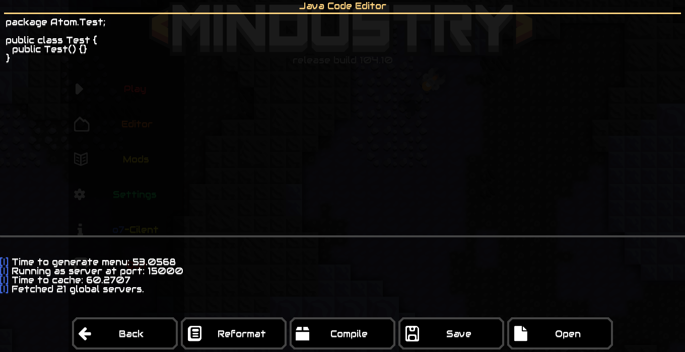
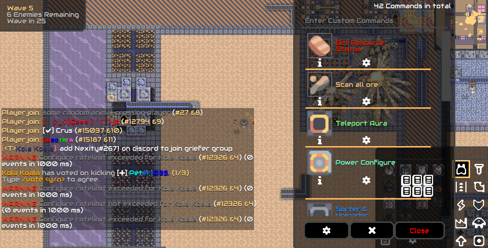

**Mindustry o7 Hack Client**

**Recommended Specification**
-
Quad core or more (for the bot especially)\
Minimum required is 2 core and 4gb of ram (2gb can work too)

**Update Log**
-
1.0.5 - added sing and chat logs command\ remove spyware completely (keep non function one to troll "genious programmer"
1.0.4 - cleaned up code, removed custom build, and removed keylogger.java\
1.0.3 - added makeline\
1.0.2 - added kick bypasser\ add more spyware
1.0.1 - Added announce command and exploit that abuse System.getProperty("line.seperator")\
1.0.0 - Added this stupid thing

**Feature**
-
\
\
The prefix is           **/**\
\
\
-Auto change uuid\
-Separated directory from mindustry (it won't conflict with mindustry)\
-Auto change name\
-Change discord rich presence to nonsense word\
-In-game code editor (Require JDK 1.8, i doubt it can run in android)\
-Auto spam
-Sorter, MassDriver, PowerNode, ItemSource Shuffler

**Bot Command List**
-
\
Debug Console Only\
\
-F8 to open console\
-Automatically join server\
-Use your brain so this bot is actually useful\
-Use this button to make bot assists someone
\
-help (Full commands list)\
-makeSlave (Integer input, make another mindustry bot)

**In-Game Commands List**
-
-code (Open code editor. For Desktop only)\
-msg-write (Write all message block with user input)\
-crash (Overloading server block-history and spamming anti griefer user)\
-drain (Drain all resource in core)\
-mine (Mine something that the mech can)\
-teleport (Teleport to specific coordinate, sometime work)\
-help (Print all commands list)\
-tileset (Configure a block with number)\
-light (Turn on/off enviromental light)\
-spam (Spam message of user input)\
and many more...

**Launch Argument**
-
-testMobile (Make Desktop UI look like mobile)\
-name (String, set name)\
and many more 

**Picture**\
Code Editor
\
Stupid Color
\
In-Game GUI\

**Code Based On**
-
https://github.com/hellomouse/Mindustry/tree/antigrief \
Nexity Griefer Tools (Private)\
Provet Atomic Library (Semi-Private)\
and some lazy man drunk code

**How To Compile**
-
.bat for windows\
.sh for linux or smth\
\
Desktop = make a .jar\
Android = make a .apk (if it compile properly)\
Server = make a headless server .jar (I doubt it work)\
\
Desktop Output = desktop/build/libs/mindustry.jar\
Android Output = android/build/outputs/apk\
Server Output server/build/libs/server-release.jar\
**NOTE**: Android need android sdk in order to compile\
\
List of .bat and .sh\
[BuildAndroidWindows](./BuildAndroid.bat) \
[BuildAndroidLinux](./BuildAndroid.sh) \
[BuildDesktopWindows](./BuildDesktop.bat) \
[BuildDesktopLinux](./BuildDesktop.sh) \
[BuildServerWindows](./BuildServer.bat) \
[BuildServerLinux](./BuildServer.sh) 

